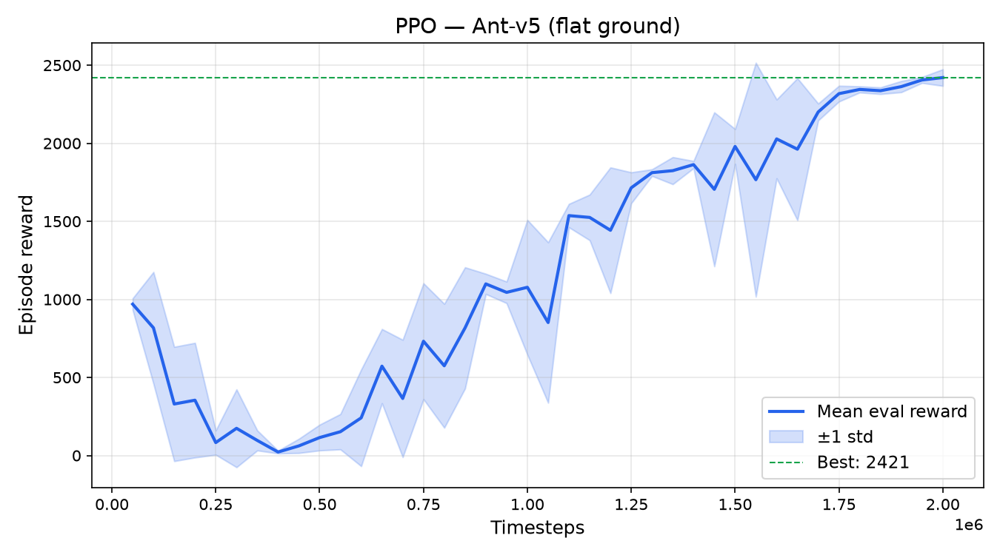
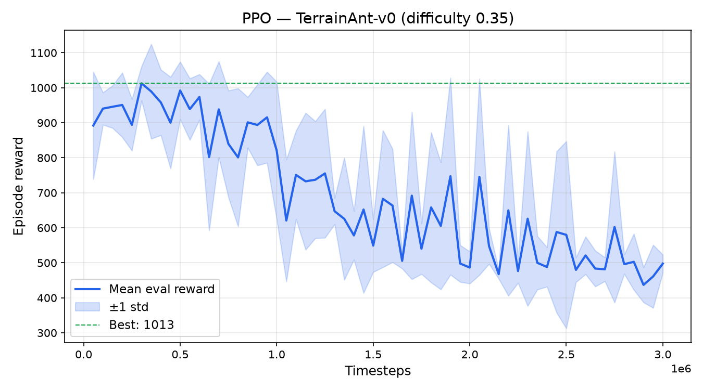
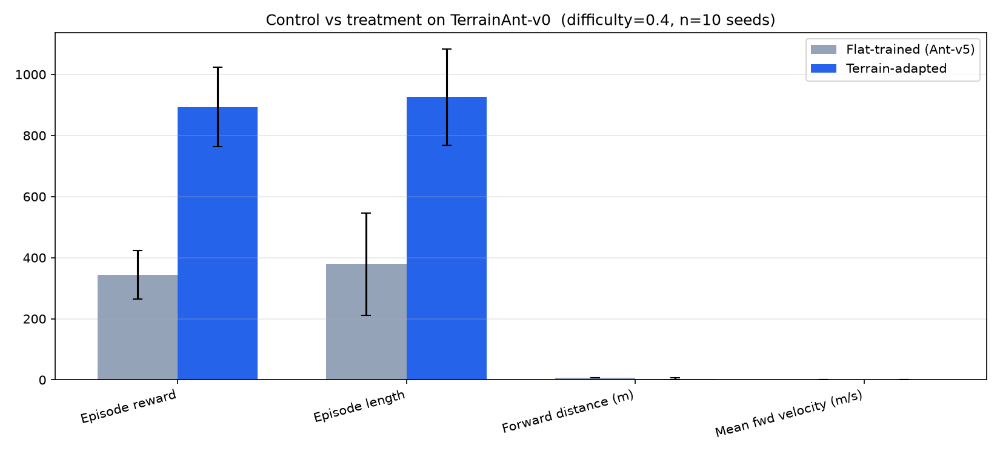
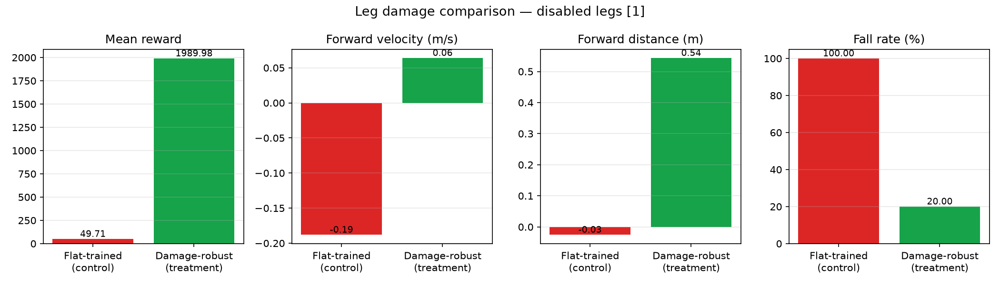

# Quadruped Locomotion with PPO

Train a 4-legged MuJoCo ant to walk on flat ground, procedurally generated rough terrain, and under leg amputation — using Proximal Policy Optimization (PPO).

**Research questions:**

1. **Terrain adaptation** — Does training on randomized heightfield terrain generalize better than a flat-trained baseline on unseen rough ground?
2. **Leg-damage robustness** — Does training for amputation produce a policy that stays upright and walks on three legs when a leg is removed at test time?

**Stack:** Python · PyTorch · Gymnasium · MuJoCo · Stable-Baselines3

## Demos

| Flat ground (Ant-v5) | Rough terrain (TerrainAnt-v0) | Terrain: control vs treatment | Leg damage: control vs treatment |
|---|---|---|---|
|  |  |  |  |

Videos: [flat demo](docs/assets/ant/demo.mp4) · [terrain demo](docs/assets/terrain/demo.mp4) · [terrain comparison](docs/assets/terrain/comparison_demo.mp4) · [damage comparison](docs/assets/damage/comparison_demo.mp4)

## Key results

Metrics below come from `docs/assets/*/comparison_results.json` (reproduce with the compare scripts).

### Experiment A — Terrain adaptation

Both policies evaluated on **TerrainAnt-v0** at **difficulty 0.4**, **10 matched seeds**, 1000-step episodes:

| Metric | Flat-trained (control) | Terrain-adapted |
|---|---:|---:|
| Mean episode reward | 424 ± 106 | **893 ± 130** |
| Mean episode length | 719 steps | **926 steps** |
| Fall rate | 50% | **30%** |
| Mean forward velocity | 0.22 m/s | 0.10 m/s |

**Takeaway:** Terrain training improves survival on unseen hills. Locomotion is slower — the policy trades speed for stability.

```bash
python compare_policies.py --difficulty 0.4 --seeds 0 1 2 3 4 5 6 7 8 9
```

### Experiment B — Leg damage robustness

Both policies evaluated on **DamageAnt-v0** with **leg 1 amputated** (front-right removed — no geometry, no ground contact), **10 matched seeds**:

| Metric | Flat-trained (control) | Damage-robust |
|---|---:|---:|
| Mean episode reward | 50 ± 40 | **1990 ± 953** |
| Mean episode length | 21 steps | **809 steps** |
| Fall rate | **100%** | **20%** |
| Mean forward velocity | -0.19 m/s | **0.06 m/s** |

**Takeaway:** Flat-trained policy tips over immediately. Damage-robust policy stays upright on 8/10 seeds and tripod-walks slowly.

```bash
python compare_damage.py --disabled-legs 1 --seeds 0 1 2 3 4 5 6 7 8 9
```

## Training results

| Policy | Training | Best eval reward | Notes |
|---|---|---:|---|
| Ant-v5 (flat) | 1M fine-tune | **3385** | Shared baseline for both experiments |
| TerrainAnt-v0 | 3M balanced fine-tune | **994** @ diff 0.4 | `configs/ppo_terrain_balanced.py` |
| DamageAnt-v0 | upright + final fine-tune | **5477** @ leg 1 out | `damage_upright` → `damage_final` |

## Quick start

```bash
python -m venv .venv
source .venv/bin/activate
pip install -r requirements.txt

python check_env.py
python train.py --config terrain_balanced
python train.py --config damage_upright   # then damage_final to reproduce damage checkpoint
python compare_policies.py
python compare_damage.py
python collect_artifacts.py --all
```

Committed checkpoints in `checkpoints/` let you run compare/evaluate without retraining.

## How it works

**TerrainAnt-v0** — procedural heightfield terrain, spawn safety, boundary termination.

**DamageAnt-v0** — leg amputation (invisible geoms, no collision, zero actuators) with gated forward reward and tip-over termination after a short grace period.

## Resume bullet

> Trained terrain-adapted and damage-robust quadruped policies (PPO, MuJoCo Ant-v5). On unseen heightfield terrain: **893 ± 130** vs **424 ± 106** reward, **30% vs 50%** fall rate. Under front-right leg amputation: **1990 ± 953** vs **50 ± 40** reward, **20% vs 100%** fall rate, **809 vs 21** mean episode steps. [github.com/FavouritePlayer/ant_sim](https://github.com/FavouritePlayer/ant_sim)

## Further reading

See [LEARNING.md](LEARNING.md) and [MUJOCO_PROJECT_SCOPE.md](MUJOCO_PROJECT_SCOPE.md).

## License

MIT — see [LICENSE](LICENSE).
